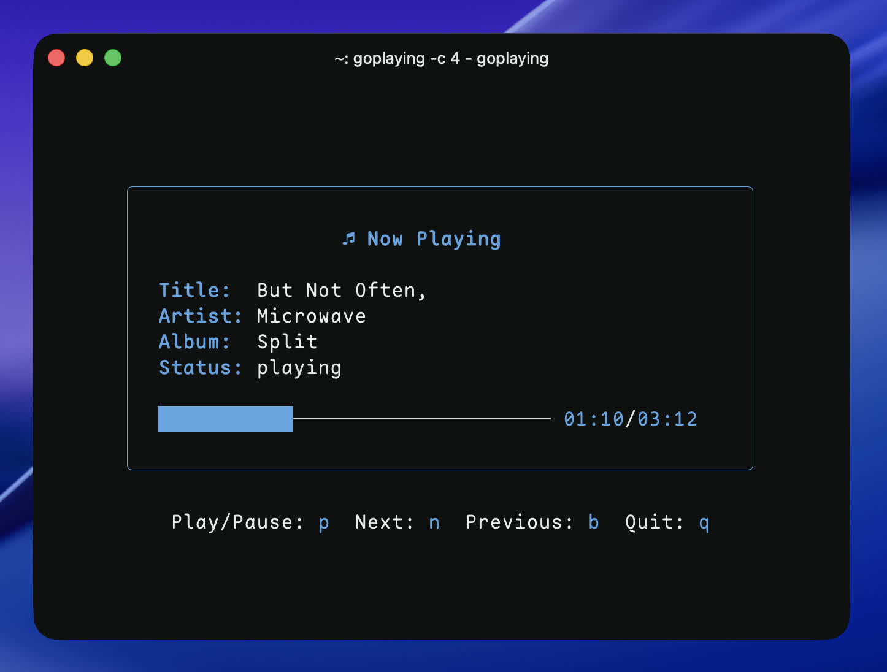

# GoPlaying

[](https://github.com/justinmdickey/goplaying/actions)
[](https://github.com/justinmdickey/goplaying/actions)

## Description

This is a basic Now Playing TUI written in Go. I wanted a simple way to see what was playing on my Spotify account without having to open the app. This cross-platform solution works on both Linux (using playerctl) and macOS (using AppleScript) to get the currently playing song and display it in the terminal. It even gives you basic controls to play/pause, skip, and go back.



## Installation

### Pre-built Binaries

Download the latest release for your platform from the [Releases page](https://github.com/justinmdickey/goplaying/releases):

- **Linux (amd64)**: `goplaying-linux-amd64`
- **Linux (arm64)**: `goplaying-linux-arm64`
- **macOS (Intel)**: `goplaying-darwin-amd64`
- **macOS (Apple Silicon)**: `goplaying-darwin-arm64`

Make the binary executable and move it to your PATH:
```bash
chmod +x goplaying-*
sudo mv goplaying-* /usr/local/bin/goplaying
```

### Arch Linux

You can install GoPlaying from the AUR with the package `goplaying-git`.
```bash
yay -S goplaying-git
```

### macOS

GoPlaying works natively on macOS using AppleScript to control Spotify.

#### Dependencies
- go
- Spotify app

### Linux

#### Dependencies
- go
- playerctl

### Manual Installation

1. Clone the repository
```bash
git clone https://github.com/justinmdickey/goplaying.git
```

2. cd into the directory
```bash
cd goplaying
```

3. Run `go build`
```bash
go build
```

4. Run `./goplaying`
```bash
./goplaying
```

## Usage

Custom colors can be set using flags:
`--color` or `-c` - Set the color of the text. This can be a color name or hex code.

```bash
./goplaying --color "#ff0000"
./goplaying -c 1
./goplaying -c=#ff0000
```

The controls are basic vim keybinds:
- `p` - Play/Pause
- `n` - Next
- `b` - Previous
- `q` - Quit

## License

This project is licensed under the MIT License - see the [LICENSE](LICENSE) file for details.
