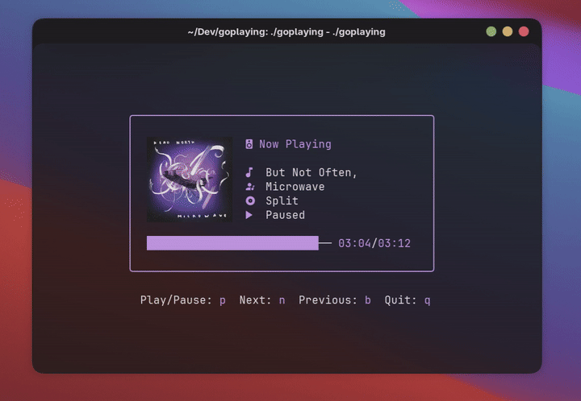

# GoPlaying

[](https://github.com/justinmdickey/goplaying/actions)

## Description

A beautiful Now Playing TUI written in Go. Display currently playing music with album artwork and auto-extracted colors in your terminal. This cross-platform solution works on both Linux (using playerctl) and macOS (using a hybrid MediaRemote + AppleScript approach) with basic playback controls.

**Supported on macOS:**
- Apple Music (including Radio streams) with artwork
- Spotify with artwork
- Other apps that implement macOS Now Playing API (via MediaRemote helper)

**Supported on Linux:**
- Any MPRIS-compatible player (via playerctl) with artwork



## Features

- 🎨 **Smart Auto Color Mode** - Automatically extracts vibrant, readable colors from album artwork
- 🖼️ **Album Artwork Display** - Shows album art in Kitty, Ghostty, and WezTerm terminals
- ⚡ **Live Configuration Reload** - Changes to config.yaml apply immediately
- 🎵 **Cross-Platform Support** - Works on Linux (MPRIS) and macOS (AppleScript/MediaRemote)
- 📱 **Wide Player Support** - Apple Music, Spotify, browsers, and any MPRIS-compatible player
- 🎹 **Playback Controls** - Play/pause, next, previous track controls

### Auto Color Mode

Set `color_mode: "auto"` in your configuration to automatically extract colors from album artwork:
- Intelligently selects vibrant, readable colors
- Filters out too-dark or washed-out colors  
- Optimized for dark terminal backgrounds
- Falls back to manual color when no artwork available

**Configuration example** (`~/.config/goplaying/config.yaml`):
```yaml
ui:
  color: "2"
  color_mode: "auto"  # "manual" or "auto"
  max_width: 45
artwork:
  enabled: true
  padding: 15
```

## Installation

### Homebrew (macOS/Linux)

The easiest way to install on macOS:

```bash
brew tap justinmdickey/tap
brew install goplaying
```

**Note**: On Linux, you'll need to install `playerctl` separately.

### Pre-built Binaries

Download the latest release for your platform from the [Releases page](https://github.com/justinmdickey/goplaying/releases):

- **Linux (amd64)**: `goplaying_*_Linux_x86_64.tar.gz`
- **Linux (arm64)**: `goplaying_*_Linux_arm64.tar.gz`
- **macOS (Intel)**: `goplaying_*_Darwin_x86_64.tar.gz`
- **macOS (Apple Silicon)**: `goplaying_*_Darwin_arm64.tar.gz`

Extract and install:
```bash
# Extract the archive
tar -xzf goplaying_*_Linux_x86_64.tar.gz  # or your platform's archive

# Make executable and move to PATH
chmod +x goplaying
sudo mv goplaying /usr/local/bin/
```

### Arch Linux

You can install GoPlaying from the AUR with the package `goplaying-git`.
```bash
yay -S goplaying-git
```

### macOS

GoPlaying works natively on macOS with Apple Music and Spotify using a hybrid MediaRemote + AppleScript approach.

**Album artwork works out of the box** with:
- ✅ **Spotify** - Downloads artwork via AppleScript
- ✅ **Apple Music** - Extracts raw artwork data via AppleScript
- ✅ Displays in Kitty, Ghostty, and WezTerm terminals

**For broader app support** (Safari, Chrome, other Now Playing apps), build the Swift helper:

```bash
# Install Xcode Command Line Tools if not already installed
xcode-select --install

# Build the project with the helper
make darwin
```

The `nowplaying` helper provides:
- Support for any app using macOS Now Playing API (Safari, Chrome, etc.)
- Faster metadata updates via MediaRemote framework
- Alternative artwork source for additional players

**Without the helper**, GoPlaying automatically uses AppleScript which:
- ✅ Works perfectly with Apple Music and Spotify
- ✅ Full album artwork support
- ✅ Auto color extraction from artwork
- ⚠️ Limited to Music.app and Spotify (no browser/other app support)

#### Dependencies
- Go 1.20+
- Swift compiler (from Xcode Command Line Tools) - optional but recommended

### Linux

#### Dependencies
- go
- playerctl

### Manual Installation

1. Clone the repository
```bash
git clone https://github.com/justinmdickey/goplaying.git
```

2. cd into the directory
```bash
cd goplaying
```

3. Build the project
```bash
# On macOS, use the darwin target to build both the helper and main binary
make darwin

# On Linux, just build the main binary
make linux
```

4. Run `./goplaying`
```bash
./goplaying
```

**Note for macOS**: The `nowplaying` helper binary should be in the same directory as `goplaying`, or in `helpers/nowplaying/`. The Makefile handles this automatically. If the helper is not found, the app will automatically fall back to AppleScript-only mode, which still works with Apple Music and Spotify but won't detect other apps.

## Usage

Custom colors can be set using flags:
`--color` or `-c` - Set the color of the text. This can be a color name or hex code.

```bash
./goplaying --color "#ff0000"
./goplaying -c 1
./goplaying -c=#ff0000
```

The controls are basic vim keybinds:
- `p` - Play/Pause
- `n` - Next
- `b` - Previous
- `a` - Toggle album artwork
- `q` - Quit

## License

This project is licensed under the MIT License - see the [LICENSE](LICENSE) file for details.
