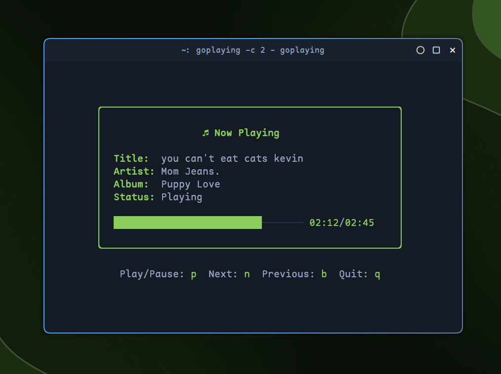

# GoPlaying

[](https://github.com/justinmdickey/goplaying/actions)

## Description

A simple Now Playing TUI written in Go. See what's currently playing without opening your music app. This cross-platform solution works on both Linux (using playerctl) and macOS (using a hybrid MediaRemote + AppleScript approach) to display currently playing music in your terminal with basic playback controls.

**Supported on macOS:**
- Apple Music (including Radio streams)
- Spotify
- Other apps that implement macOS Now Playing API

**Supported on Linux:**
- Any MPRIS-compatible player (via playerctl)



## Installation

### Homebrew (macOS/Linux)

The easiest way to install on macOS:

```bash
brew tap justinmdickey/tap
brew install goplaying
```

**Note**: On Linux, you'll need to install `playerctl` separately.

### Pre-built Binaries

Download the latest release for your platform from the [Releases page](https://github.com/justinmdickey/goplaying/releases):

- **Linux (amd64)**: `goplaying_*_Linux_x86_64.tar.gz`
- **Linux (arm64)**: `goplaying_*_Linux_arm64.tar.gz`
- **macOS (Intel)**: `goplaying_*_Darwin_x86_64.tar.gz`
- **macOS (Apple Silicon)**: `goplaying_*_Darwin_arm64.tar.gz`

Extract and install:
```bash
# Extract the archive
tar -xzf goplaying_*_Linux_x86_64.tar.gz  # or your platform's archive

# Make executable and move to PATH
chmod +x goplaying
sudo mv goplaying /usr/local/bin/
```

### Arch Linux

You can install GoPlaying from the AUR with the package `goplaying-git`.
```bash
yay -S goplaying-git
```

### macOS

GoPlaying works natively on macOS with Apple Music and Spotify using a hybrid MediaRemote + AppleScript approach.

#### Dependencies
- Go
- Swift compiler (included with Xcode or Command Line Tools)

### Linux

#### Dependencies
- go
- playerctl

### Manual Installation

1. Clone the repository
```bash
git clone https://github.com/justinmdickey/goplaying.git
```

2. cd into the directory
```bash
cd goplaying
```

3. Build the project
```bash
# On macOS, use the darwin target to build both the helper and main binary
make darwin

# On Linux, just build the main binary
make linux
```

4. Run `./goplaying`
```bash
./goplaying
```

**Note for macOS**: The `nowplaying` helper binary should be in the same directory as `goplaying`, or in `helpers/nowplaying/`. The Makefile handles this automatically. If the helper is not found, the app will automatically fall back to AppleScript-only mode, which still works with Apple Music and Spotify but won't detect other apps.

## Usage

Custom colors can be set using flags:
`--color` or `-c` - Set the color of the text. This can be a color name or hex code.

```bash
./goplaying --color "#ff0000"
./goplaying -c 1
./goplaying -c=#ff0000
```

The controls are basic vim keybinds:
- `p` - Play/Pause
- `n` - Next
- `b` - Previous
- `q` - Quit

## License

This project is licensed under the MIT License - see the [LICENSE](LICENSE) file for details.
